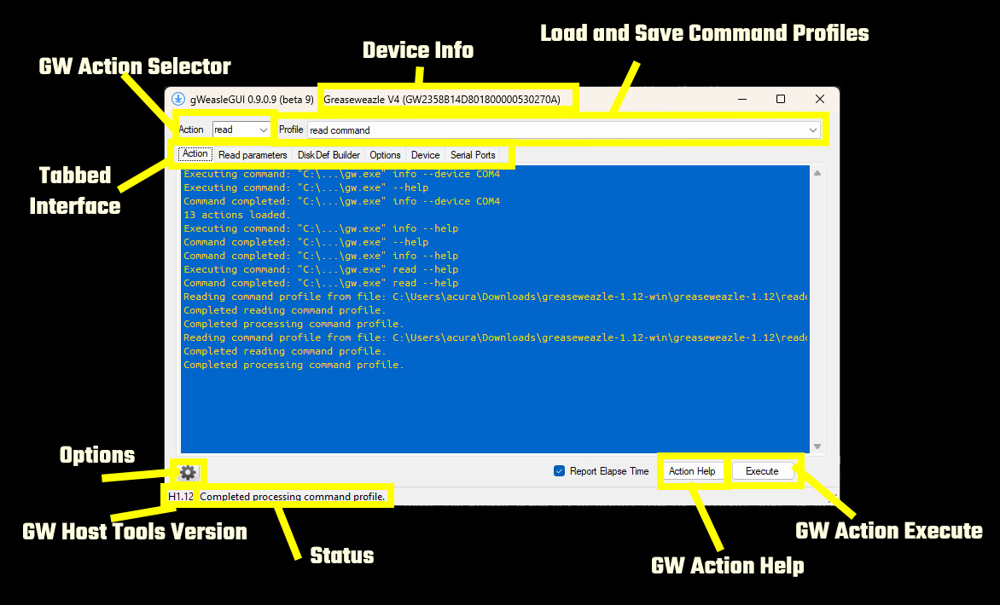

# gWeazleGUI

![CI Badge][ci-badge]
![Downloads Badge][downloads-badge]
![Version Badge][version-badge]



GW Host Tools GUI.

- [Downloads](https://github.com/Akutra/gWeazleGUI/releases)
- [Web Site](https://github.com/Akutra/gWeazleGUI)
- [Documentation]()
- [Bug Reports](https://github.com/Akutra/gWeazleGUI/issues)
- [Donate]()

## Overview

gWeazleGUI is a graphical user interface for the grease weazle device.

## Features

* Support for Windows (Ubuntu will be soon)
* Easy to use single window interface
* Access to all the command line options available in gw host tools 
* Retain setting in an XML file to reuse later

## Install

To install gWeazleGUI, copy the binary to desired path.
- Grease Weazle Host Tools v1.12 or greater is required.

### Windows

Doubleclick the executable and enter the path to your gw host tools. GW Host Tools can be unzipped to any directory for use.
>If gWeazleGUI does not automatically ask you for the gw tools path, click options (the cog wheel) and input them.

#### Linux (e.g. Ubuntu)

TBD.

## Using the App

>If gWeazleGUI does not automatically ask you for the gw tools path, click options (the cog wheel) and input them.

Single window graphic user interface that you can use like the command prompt host tools. You execute the command after configuring the command details from the window.

## Build from Source Code

To build the application from source code, install Visual Studio (Windows) or MonoDevelop (Linux).

- [Git](https://git-scm.com/)
- Visual Studio
- .NET 4.7.2 (Visual Studio)

### Build the App on Windows

Locate your repos directory (e.g. C:\Users\<user>\source\repos\)
```
cd C:\Users\<user>\source\repos
git clone https://github.com/Akutra/gWeazleGUI.git
```
Open the csproj file in Visual Studio from the repo (e.g. C:\Users\<user>\source\repos\gWeasleGUI\gWeasleGUI.csproj
Compile for x64 Release.

You can now run the built app.

## Contributions

To Be Determined.
